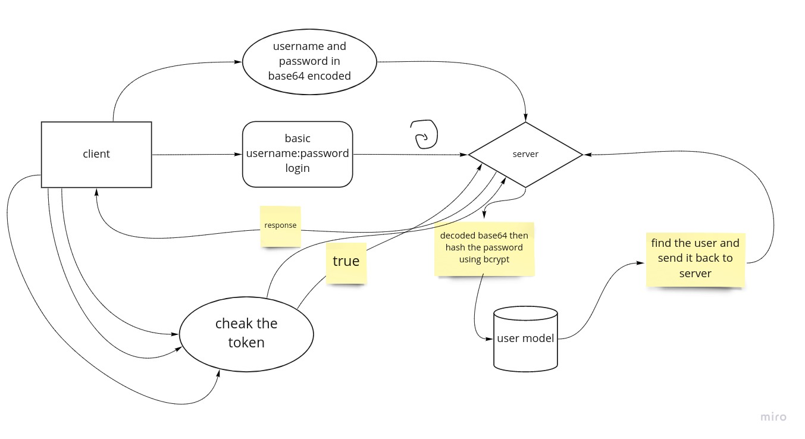

# bearer-auth

[heruku app Url](https://bearer-auth-ahmad.herokuapp.com/)

[dev branch link](https://github.com/ahmadammmoura/bearer-auth/tree/dev)

[action link](https://github.com/ahmadammmoura/bearer-auth/actions)

### UML

